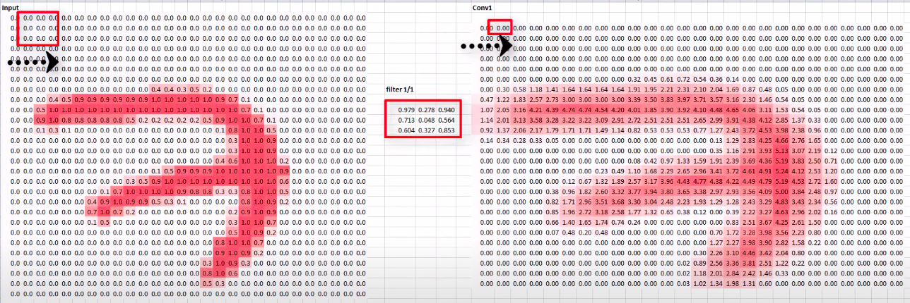

# AI Pool 2021 - Deep Learning - XRAI

Cette journée va être chargé ingenieur. 
À force de vivre sous terre, de noumbreux civils rencontrent des problemes respiratoires. 
Il s'avere que pour certains patients, c'est un cas de pneumoni, c'est une maladie grave et nos medecin n'ont pas le temps d'analyser les resultats de chaques patients. 

Heuresement avec le nouveau framework que l'equipe scientifique vous à présenté, vous êtes aptes à fournir une solution pour aider nos medecins. 

Uttilisez la librairie _Pytorch_ pour créer un model identifiants les cas de pneumoni depuis des photos X-Ray. 

Contrairement à la demonstration faite par l'equipe scientifique, vous devez charger vous meme le dataset. 
Pour cela l'equipe scientifique vous fournit un outil qui vous sera utile: _h5py_

Pour maximiser votre accuracy l'equipe scientifique vous invite à implementer des Convolutions et du Pooling dans votre reseau neuronal. 
N'ayez crainte, ils vous ont redigé un manuel sur les reseaux de neurones convolutifs.

## Manuel Convolutional Neural Network
 
 L'objectif des convolutions est d'apprendre à detecter des patterns spécifiques sur le contenu d'une image.
 Par exemple detecter les yeux sur des portrait, ou encore le museau d'un chien etc.
 
 Pour cela on applique un filtre à l'image donné en intput, c'est notre convolution.
 Voyez le filtre comme une simple matrice ou l'on choisis le nombre de lignes et colonnes. 
 L'uttilisateur est libre de choisir le nombre de filtres par convolutions. 
 
 Prenons en exemple un filtre de taille (3\*3). 
 Quand le layer convolutif recevra une image en input, il appliquera son filtre à chaque set de 3\*3 pixels. 
 Pour chaque set de 3\*3 pixel l'output resultant sera le produit scalaire du filtre par le set de pixels. 
 
 
 L'output final sera alors l'input du prochain layer qui repetra le meme procédé.
.
 Et le pooling dans tout ça ?
 
 

 
En bref, vous prenez un filtre (généralement 3x3 ou 5x5) et vous le passez sur l'image. En modifiant les pixels sous-jacents en fonction de la formule de ce filtre représenté par une matrice, vous pouvez effectuer des opérations telles que la détection des contours. Ainsi, par exemple, si vous examinez le lien ci-dessus, vous verrez que pour un filtre de 3x3 défini pour la détection de contours, la cellule du milieu est définie à 8 et tous ses voisins à -1. Dans ce cas, pour chaque pixel, vous allez multiplier sa valeur par 8, puis y soustraire la valeur de chaque voisin. En le faisant pour chaque pixel, vous obtiendrez une nouvelle image dont les contours sont améliorés.

C'est parfait pour le computer vision, parce que souvent les features qui définissent un objet ne représentent qu'une partie de l'image entière, et que l'information dont on a besoin est beaucoup plus faible que tous les pixels de l'image. Ce concept nous permet alors de nous focaliser uniquement sur des features qui sont mises en valeur.

En ajoutant des couches de convolution avant vos couches dense, l'information fournie aux dense layers est bien plus ciblée, et potentiellement plus précise.

**Useful links:**
- Convolutional Neural Networks (CNNs) explained: https://www.youtube.com/watch?v=YRhxdVk_sIs
